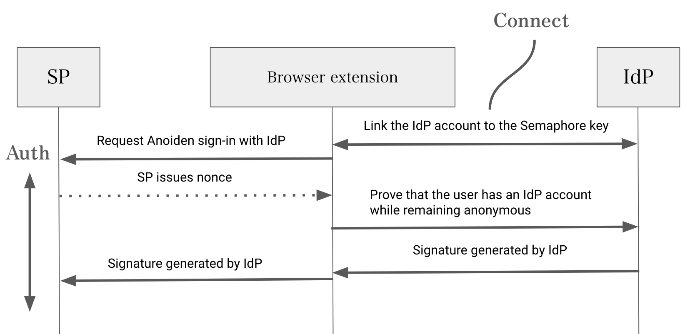
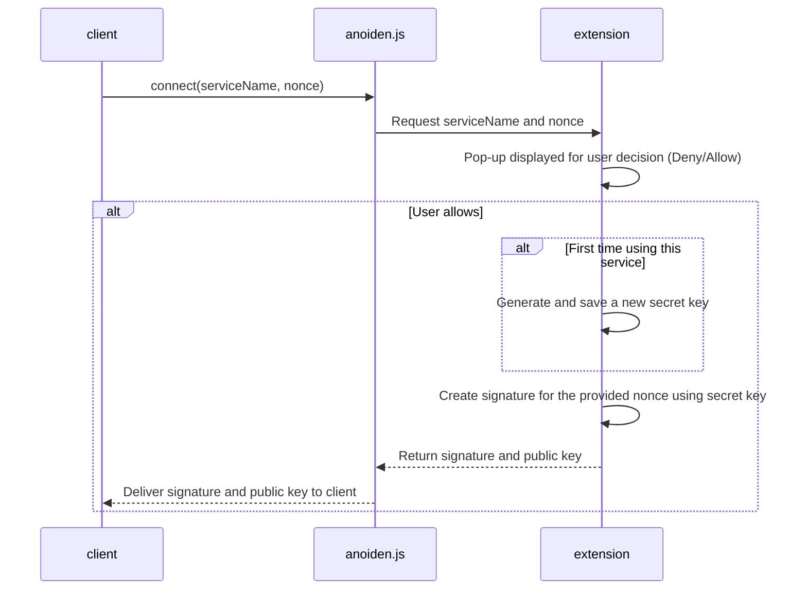
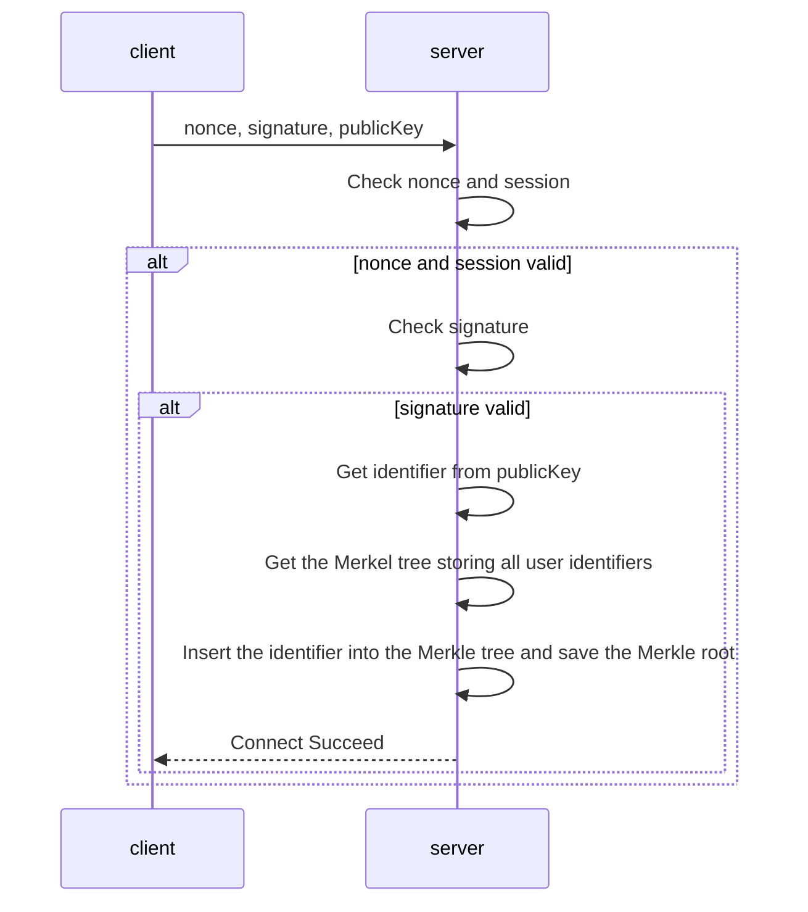
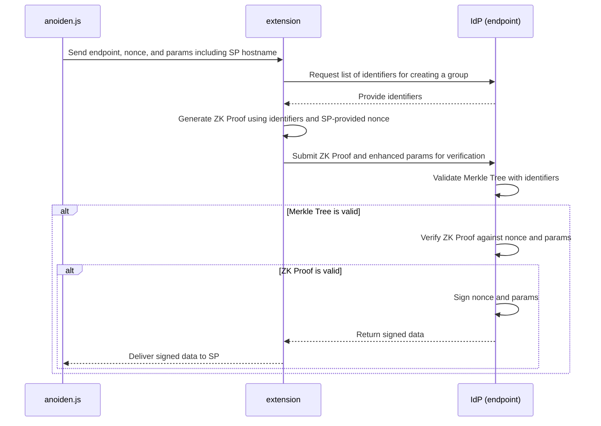

# Anoiden V1 Spec

## Overview
Anoiden is an anonymous single sign-on protocol utilizing zero-knowledge proofs. This protocol enables users to sign in to service providers (SP) while keeping their identity secret, even if the identity provider (IdP) and service provider collude.
It utilizes the [Semaphore](https://github.com/semaphore-protocol/semaphore).



Users create an account in a method specified by the IdP (such as registering an email or phone number) and connect it to a zero-knowledge proof key (Connect).

SPs trust the IdP and are aware of the authentication endpoint. Users request to log in at the SP via the IdP and obtain a nonce. Subsequently, users create a proof of their identity and send it to the IdP. If the proof verifies the user’s legitimacy, the IdP generates the corresponding signature (Auth).

## Terms
- Extension: A browser extension that manages user keys and creates proofs, necessary to ensure identity secrecy even if the SP and IdP collude.
- anoiden.js: Provides an interface for web clients to communicate with the extension.
- Identity Provider (IdP): The entity that provides user legitimacy information to the SP.
- Service Provider (SP): The entity that uses the legitimacy information provided by the IdP.

## Connect
When a user completes account registration at an SP, they can link that account with the key in the extension.
This linkage allows the user to use this IdP for future authentication requests and to log in to the IdP anonymously.

The SP retrieves the signature and public key via anoiden.js.

```javascript
const {signature, publicKey} = await connect(serviceName, nonce);
```
Here, serviceName refers to the service name used for key management, and nonce is an unpredictable string obtained from the SP server-side.




The client sends the obtained signature, public key, and nonce to their server.
The server verifies the session and checks if it issued the nonce to that user.
If valid, the server verifies the signature, retrieves the identifier (Poseidon hash of the public key), adds the identifier to the Merkle Tree, and saves the updated Merkle Root.



Specific communication methods and specifications between client/server in SP are beyond the scope of this document.


## Authorize
The SP obtains a signature from the IdP via anoiden.js.

```javascript
const idPSignature = await auth(endpoint, nonce, params);
```

Here, endpoint supports GET and POST methods.
GET returns a list of all account identifiers.
POST verifies the proof and confirms user legitimacy.
params are arbitrary parameters agreed between SP and IdP, but clientId is required.

After receiving endpoint, nonce, params, the extension retrieves identifiers and uses Semaphore to create a proof like this:
```javascript
await generateProof(identity, group, nonce, "signIn");
```
identity is a key created per IdP, group is an object created from identifiers, and nonce is provided by the SP.

params will also include hostname.
The IdP uses clientId along with hostname to identify the SP requesting the signature.

After receiving the proof and parameters, the IdP validates the Merkle Tree with identifiers.
If valid, it verifies the ZK Proof against the nonce and parameters, then signs the nonce and parameters if the proof is valid.



The client sends the received signature to the server, which verifies it.
Its specification is outside the scope of this document.


### Endpoint interface
The IdP’s endpoint has the following interfaces:

#### GET endpoint/identifiers
No parameters required.
The response is in JSON, returning a list of identifiers under the key identifiers.

Example response:
```json
{
  "identifiers": ["6423154662976160105169106896701549153516891642211172349909782921108153674476"]
}
```

#### POST endpoint/auth
The request body needs a JSON object containing the proof (proof) and parameters (params).
The response is also in JSON format, with the signature included as a string under the key signature.


```json
{
  "signature": "hoge"
}
```


## Concerns

As the number of identities increases, the system becomes inefficient.
Therefore, we are considering dividing identities into groups, although this raises privacy concerns.

If SPs use only one IdP, absolute trust in the IdP is required.
Thus, in V2, it will be possible to use multiple IdPs simultaneously at sign-in, termed Decentralized SSO.


