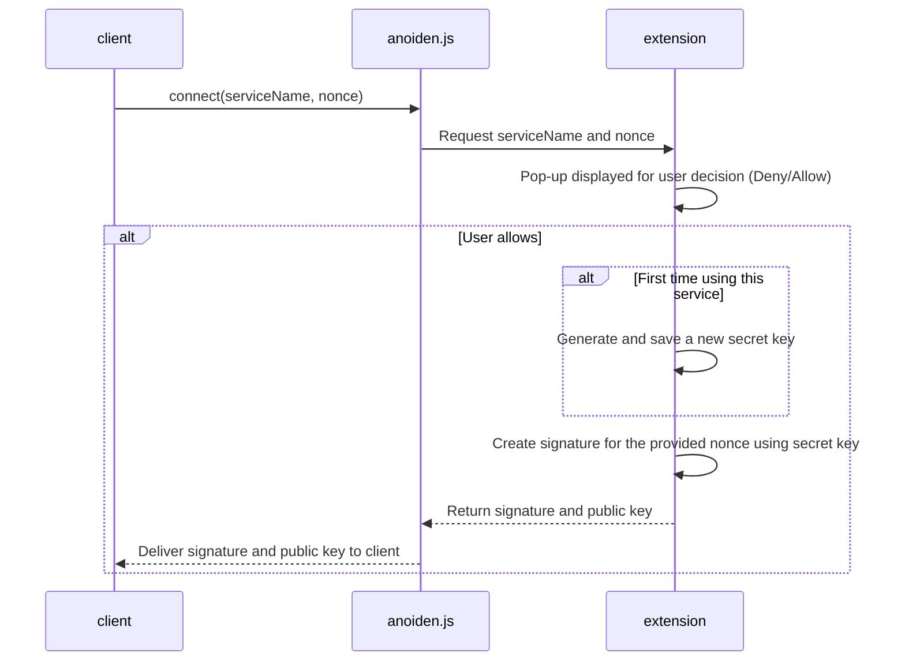
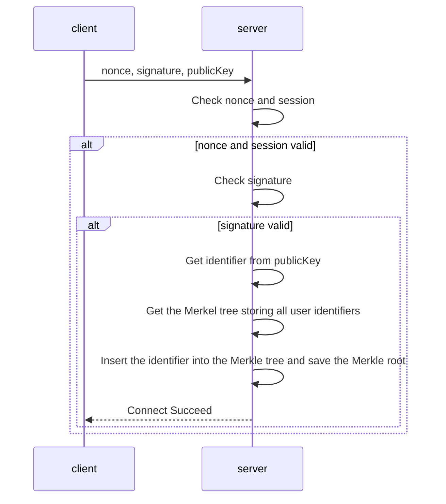
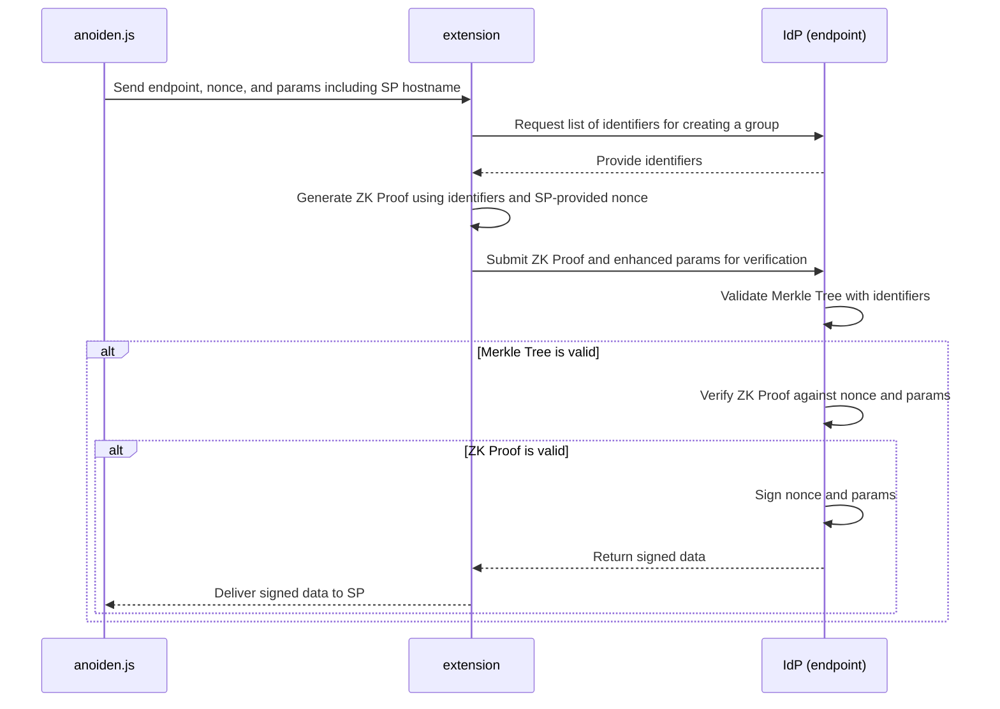

# Anoiden V1 Spec

## Overview
Anoidenは、ゼロ知識証明を用いた匿名シングルサインオンプロトコルです。このプロトコルは、アイデンティティプロバイダー（IdP）とサービスプロバイダー（SP）が共謀しても、ユーザのアイデンティティを秘密に保ちながらSPへのサインインを可能にします。これは[Semaphoreライブラリ](https://github.com/semaphore-protocol/semaphore)が利用されています。


ユーザは、IdPが指定する方法（Eメールや電話番号の登録など）でアカウントを作成し、ゼロ知識証明の鍵と接続します（Connect）。

SPはIdPを信頼しており、認証のエンドポイントを知っています。ユーザはSPに対してIdPでのログインを要求し、ノンスを取得します。その後、ユーザは自身のアイデンティティの証明を作成しIdPに送信します。IdPは証明を確認し、ユーザが正当であれば対応する署名を作成します（Auth）。


## Terms
- 拡張機能: ブラウザ拡張機能で、ユーザの鍵管理や証明の作成等を行います。SPとIdPが結託してもアイデンティティが秘匿されるために必要です。
- anoiden.js: ウェブサイトのクライアントに拡張機能と通信するためのインターフェイスを提供します。
- アイデンティティプロバイダー（IdP）: ユーザの正当性の情報をSPに提供する主体です。
- サービスプロバイダー（SP）: IdPから提供されるユーザの正当性を利用する主体です。


## Connect
ユーザがSPでアカウント登録を完了すると、そのアカウントと拡張機能側の鍵を連携できます。この連携により、ユーザは今後、認証を要求された際にこのIdPを使用可能になります。また、鍵を使って匿名でIdPにログインすることも可能になります。

SPはanoiden.jsを通じて、署名と公開鍵を取得します。

```javascript
const {signature, publicKey} = await connect(serviceName, nonce);
```
ここでserviceNameはサービス名で、鍵の管理に使用されます。nonceは推測が不可能な文字列で、SPのサーバサイドから取得します。




クライアントは取得した署名、公開鍵、ノンスを自身のサーバに送信します。サーバはセッションを確認し、そのユーザに対してそのノンスを発行したかを確認します。有効であれば署名を検証し、identifier（公開鍵のposeidonハッシュ）を取得し、Merkle Treeにidentifierを追加し、追加後のMerkle Rootを保存します。




SPにおけるクライアント/サーバ間の具体的な通信方法や仕様については本稿の範囲外です。


## Authorize
SPはanoiden.jsを通じて、IdPからの署名を取得します。

```javascript
const idPSignature = await auth(endpoint, nonce, params);
```

ここでendpointはGETとPOSTメゾットを持ちます。GETは全アカウントのidentifierを返します。POSTは証明を検証し、ユーザの正当性を確認します。paramsはSPとIdP間で定めた任意のパラメータですが、clientIdは必須です。

拡張機能はendpoint, nonce, paramsを受け取った後、identifiersを取得し、Semaphoreを利用して以下のように証明を作成します。
```javascript
await generateProof(identity, group, nonce, "signIn");
```
identityはIdP別に作成した鍵、groupはidentifiersから作成したオブジェクト、nonceはSPから渡されたノンスです。

また、paramsにhostnameを追加します。IdPは、署名を要求したSPを識別するためにclientIdと合わせてhostnameを利用します。

IdPは証明とパラメータを受け取り、証明を検証した後でSPと事前に共有した形式の鍵でノンスとパラメータの署名を作成します。



クライアントは受け取った署名をサーバに送信し、サーバ側で検証します。その仕様は本稿で定める範囲外です。


### Endpoint interface
IdPのエンドポイントは以下のインターフェイスを持ちます。

#### GET endpoint/identifiers
パラメータはありません。レスポンスはJSONで、identifiersキーにidentifierのリストが文字列で返されます。

返答例
```json
{
  "identifiers": ["6423154662976160105169106896701549153516891642211172349909782921108153674476"]
}
```

#### POST endpoint/auth
リクエストボディには、証明（proof）とパラメータ（params）を含むJSONオブジェクトが必要です。レスポンスもJSON形式で返され、signatureキーには署名が文字列として含まれます。

```json
{
  "signature": "hoge"
}
```


## Concerns

アイデンティティが多くなった場合、非効率になります。そのためアイデンティティのグループを分割することを考えていますが、その場合はプライバシーに関する懸念があります。


SPが一つのIdPのみを利用する場合、IdPに対する絶対的な信頼が必要になります。そこで、V2ではサインイン時に同時に複数のIdPを利用することも可能にします。これをDecentralized SSOと名付けます。


